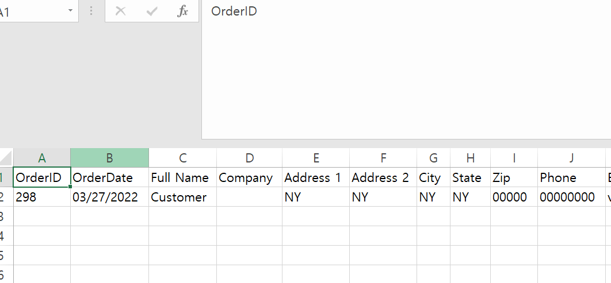

<br>

## 📌 DB 데이터 추출해서 엑셀에 보여주기

송장 출력을 위해 배송사 시스템에 주문 데이터를 엑셀 파일에 넣어 업로드해야한다.     
즉 DB에서 데이터를 추출해서 엑셀에 넣어 해당 파일을 고객이 다운받을 수 있도록 해야한다.        
배송사마다 업로드하는 엑셀 데이터, 순서, 형식이 다르다.     
여러 배송사가 사용할 수 있는 구조를 만들어야 한다.      
데이터 형식도 배송사마다 다르기 때문에 DB 데이터를 추출한 뒤 이를 가공해서 엑셀에 넣을 수 있어야 한다.      

<br>

## 📌 주요 코드

[TicketFileCreator.cs](./Code/TicketFileCreator.cs)

DB에서 데이터 추출한뒤 이를 가공해서 excel에 넣을 데이터 리스트로 만듬      

```C#
    var ticketList = TicketDao.FindTicket(siteId, orderIds);
    var ticketExcelList = new List<TicketExcelItem>();
    foreach (var item in ticketList)
    {
        // 하나의 item은 엑셀 데이터 ROW
        // 추출한 데이터 가공해서 실제 엑셀에 넣어야 하는 데이터 만들기
        var excelItem = TicketItemConverter.ToExcelItem(item); 
        ticketExcelList.Add(excelItem);
    }
    return ticketExcelList;
    
```

<br>

[TicketItemConverter.cs](./Code/TicketItemConverter.cs)

DB 데이터 → 엑셀에 표시할 데이터로 변환 후 TicketExcelItem에 값을 넣고 item return        

``` C#
    var excelItem = new TicketExcelItem(); 
    excelItem.OrderId = item.OrderId;
    excelItem.OrderDate = item.OrderDate;
    excelItem.FullName = item.FullName;
    excelItem.Company = item.Company
```

<br>

[ExcelCreator.cs](./Code/ExcelCreator.cs)       

TicketExcelItem으로 엑셀의 각 행을 만든다.         

```C#
    var row = sheet.CreateRow(currentRowIndex);
    
    // TicketOrderAttribute로 지정한 순서대로 item 값들 OrderBy
    var cellDataList = item.GetType()
                            .GetProperties()
                            .OrderBy(o => o.GetCustomAttributes<TicketOrderAttribute>().Single().Order)
                            .ToList();

    for (var i = 0; i < cellDataList.Count; i++)
    {
        var cell = row.CreateCell(i);
        cell.SetCellValue(cellDataList[i].GetValue(item)?.ToString() ?? string.Empty);
        if (style != null) cell.CellStyle = style;
    }    
```

<br>

[TicketExcelItem.cs](./Code/TicketExcelItem.cs)         

엑셀에 들어갈 데이터를 위한 객체(엑셀의 ROW). TicketOrder로 설정한 순서대로 값이 표시된다.     

``` C#
    // OrderId > OrderDate 순으로 엑셀에 표시됨
    [TicketOrder(1)]
    public int OrderId { get; set; }
    [TicketOrder(2)]
    public string OrderDate { get; set; } = string.Empty;

```

[주요 코드 링크](./Code)

<br>

## 📌 결과

