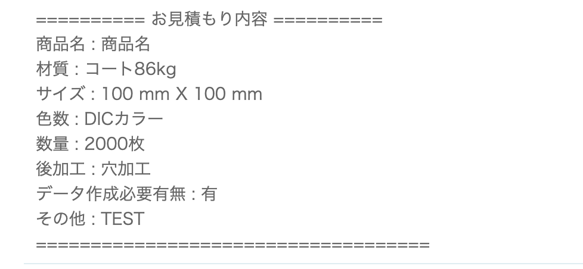

<br>

### 📌 선택한 값(상품 카테고리)에 따라 Form 표시 & Form에 입력한 값 CRUD 기능 구현

***

#### 1. form html을 넣을 테이블(form 테이블이라 하자) 생성 후 데이터 INSERT   

- 컬럼 A에는 작성 또는 수정할 때 사용하는 html을 넣는다.
- 컬럼 B에는 작성한 form 내용을 보여줄 때 사용하는 html을 넣는다.     

#### 2. 상품 카테고리 SELCT BOX 값과 표시할 form을 매핑해주는 테이블 생성 및 데이터 INSERT

- 상품 카테고리 id - form id     

#### 3. 선택한 상품 카테고리에 따라 form을 조회해 화면에 표시 (INSERT, UPDATE)

3-1. 상품 카테고리 선택      

* AngularJS ng-include로 select box 값이 변할 때마다 parameter 값 다르게 해서 REQUEST 전송    

``` javascript
$scope.GetWriteTemplateUrl = function () {
   return "/Customer/GetEstimateWriteForm?tabType=" + $scope.tabType + "&topList=" + $scope.topList;
};
```

``` html
<div>
   <ng-include src="GetWriteTemplateUrl()"></ng-include>
</div>
```

3-2. 상품 카테고리 & form 매핑 테이블에서 form id 조회 

```C#
public ContentResult GetEstimateWriteForm(string tabType, string topList)
{
   var form = FormService.FindFormByTabTypeAndTopList(tabType, topList);
   return Content(form.A, "text/html", System.Text.Encoding.UTF8);
}
```

3-3. form table에서 html(A)을 가져와 load


#### 4. form에 작성한 값들을 보여줄 때는 보여주기 위한 html(B)을 load 한다.   



#### 5. form에 입력한 값들은 JSON으로 전달해 db에 INSERT     

```javascript
JSON.stringify({ "formData": $scope.formData })
```

#### 6. form에 입력한 값을 수정하거나 조회할 때도 JSON으로 작업. AngularJS로 데이터 바인딩

<br>

### 📌 Reference

https://www.adprint.jp/Customer/Estimate
