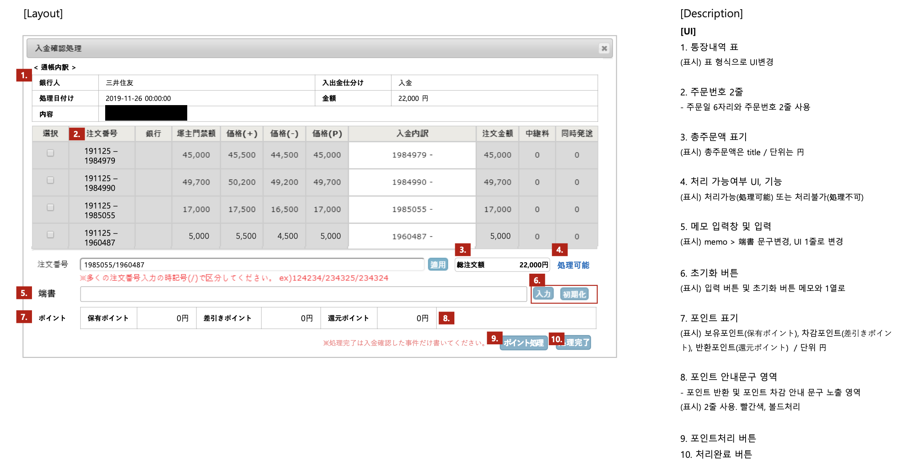

 

## 📌 주문 은행 입금 금액 비교 & 포인트 처리 자동화

은행입금 내역 db에 수집 -> 관리자가 수집내역과 주문금액을 확인해 주문 입금처리

✅ BEFORE

주문 금액과 입금 내역(들) 중 금액이 일치하는 경우 관리자가 해당 주문 입금처리    
관리자가 직접 계산해서 금액 비교   
입금한 금액이 부족할 경우 고객과 연락해 추가 입금 요청   
입금한 금액이 초과될 경우 고객과 연락한 뒤 포인트로 그만큼 지급    

✅ AFTER

주문과 입금내역의 금액이 일치하는지 자동으로 체크   
입금내역 금액이 주문금액 미만인데 포인트로 처리 가능할 경우 부족한 금액 포인트로 가져와서 입금처리   
입금내역 금액이 주문금액 미만이고 고객의 포인트도 부족할 경우 입금 처리 불가   
입금한 금액이 초과될 경우 입금처리 후 자동으로 남은 금액 포인트로 지급    

 

## 📌 주요 코드 

[주요 코드 링크](./Code)

 

## 📌 결과 

