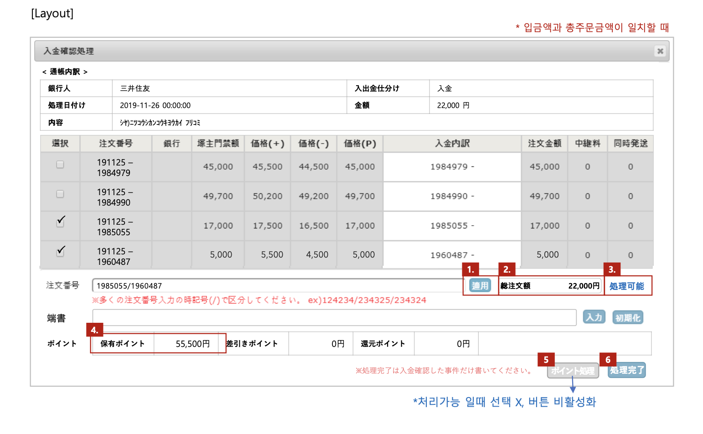
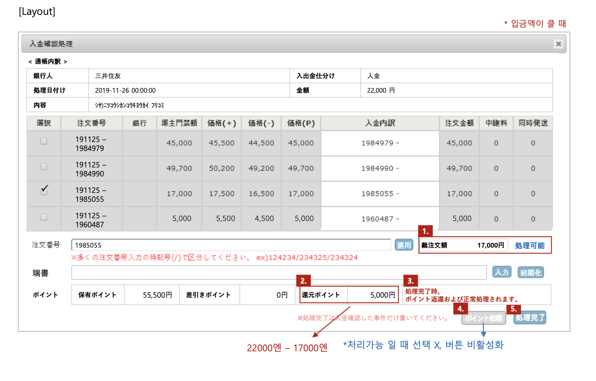
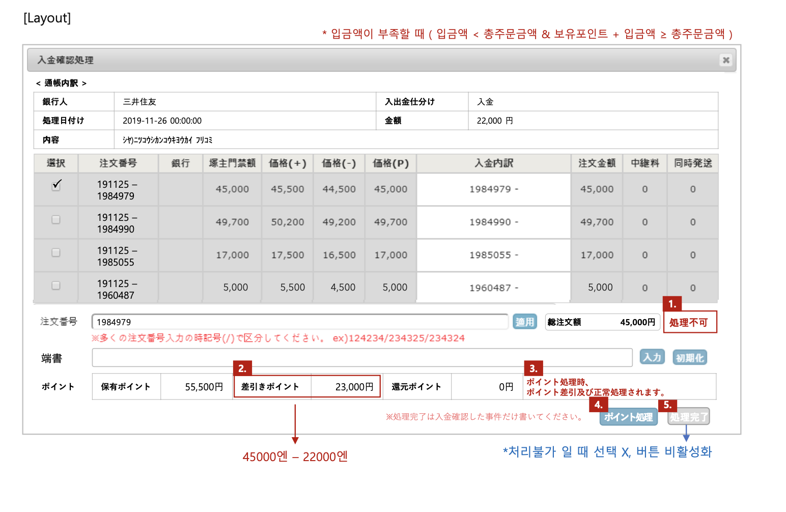
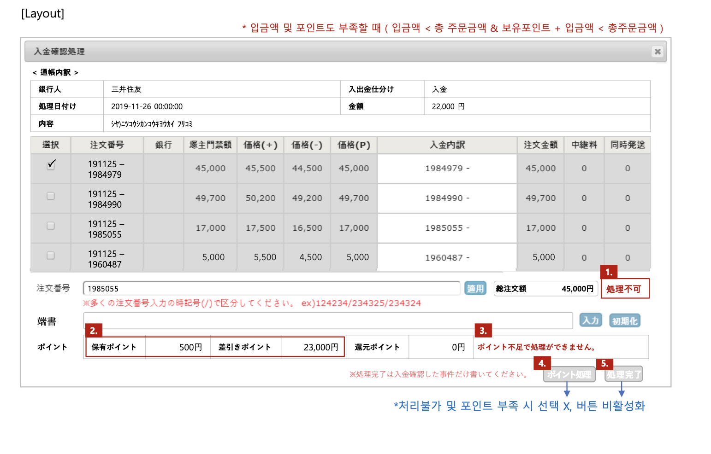

<br>

## 📌 은행 입금 결제 주문 입금 처리 프로세스 자동화

### 입금 처리 프로세스

✅ BEFORE

1. 은행 입금 결제 주문   
2. 고객이 은행에 입금    
3. 은행 입금 내역 db에 수집     
4. 관리자가 수집한 입금 내역과 주문 금액을 확인
5. **관리자가 입금 내역을 기준으로 고객 주문 입금 처리(입금 상태 변경)**

기존에는 관리자가 총주문 금액과 입금한 금액이 일치하는지 직접 계산    
입금액이 부족할 경우 포인트를 사용할 수 있는지 계산 후 수동으로 포인트 차감    
입금액이 많은 경우에도 계산해서 수동으로 포인트로 지급    

<br>

✅ AFTER

### 자동화 

입금한 금액이 총주문 금액(선택한 주문의 주문 금액 합)과 일치하는지, 포인트로 처리 가능한지 자동으로 체크   
차감 또는 지급할 포인트 자동으로 계산해서 처리    
입금 처리 = 입금 내역 처리 완료 상태로 변경 & 주문 상태 입금 완료로 변경   
하나의 입금 내역으로 여러 주문을 입금 처리할 수 있다. 

CASE1. 총주문 금액 == 입금액   
입금 처리    

CASE2. 총주문 금액 < 입금액   
입금 처리 후 남은 금액 자동으로 계산해서 고객에게 포인트로 지급   

CASE3. 입금액 < 총주문 금액 < 입금액 + 고객이 보유한 포인트   
부족한 금액만큼 고객 포인트 차감 후 입금 처리

CASE4. 입금액 < 입금액 + 고객이 보유한 포인트 < 총주문 금액     
입금 처리 불가

### 자동화로 인한 이점

입금 처리를 위해 사람이 직접 금액 계산을 하지 않아도 된다.    
입금 처리에 드는 시간이 줄어든다.   
포인트를 잘못 지급하거나 금액 계산을 잘못하는 등 기존의 수동 작업으로 발생할 수 있는 문제를 예방할 수 있다.

<br>

## 📌 주요 코드 

[ProcType.cs](./Code/Model/ProcType.cs)   

```C#
  // 입금 처리 CASE 구분
  public enum ProcType
  {
      GENERALPROC, // CASE1
      RETURNPOINTPROC, // CASE2
      DEDUCTIONPOINTPROC, // CASE3
      CANNOTPROC // CASE4
  }
```

<br>

[DepositProcInfoGetter.cs](./Code/DepositProcInfoGetter.cs)     

``` C#
  /* 
    DepositMatchingInfoGetter로 필요한 데이터 조회 (총주문 금액, 고객 보유 포인트, 입금액)
    DepositProcInfoGetter에서 DepositMatchingInfoGetter로 기반으로 지급 또는 차감할 포인트 계산, 입금 처리 CASE 구분(어떤 procType인지)
  */
  public DepositProcInfo Get(int id, string orderIds)
  {
      var matchingInfo = DepositMatchingInfoGetter.Get(id, orderIds); // 총주문 금액, 고객이 보유한 포인트, 입금액 가져오기
      return GetProcInfo(matchingInfo); // CASE분석 후, 지급할 포인트, 차감할 포인트 계산
  }

  private DepositProcInfo GetProcInfo(DepositMatchingInfo matchingInfo)
  {
      var procType = GetProcType(matchingInfo); // CASE 분석
      var returnPoint = GetReturnPoint(procType, matchingInfo); // 반환할 포인트
      var deductionPoint = GetDeductionPoint(procType, matchingInfo); // 차감할 포인트
      return new DepositProcInfo() { DepositMatchingInfo = matchingInfo , ProcType = procType, ReturnPoint = returnPoint, DeductionPoint = deductionPoint};
  }
```

<br>

[DepositConfirmService.cs](./Code/DepositConfirmService.cs)     

``` C#
  /*
    입금 처리 
    submitInfo : 적용 버튼 눌렀을 때 조회해 return 받은 DepositMatchingInfo
  */
  [Transaction]
  public void ConfirmDeposit(int id, string orderIds, string memo, DepositMatchingInfo submitInfo, string adminId)
  {
      DepositConfirmOrders(id, orderIds, submitInfo, adminId);
      DepositDao.ConfirmDeposit(id, orderIds, memo, adminId);  // 입금 내역 상태 변경
  }

  private void DepositConfirmOrders(int id, string orderIds, DepositMatchingInfo submitInfo, string adminId)
  {
      var currentInfo = DepositProcInfoService.GetDepositProcInfo(id, orderNums);
      // 기존에 조회했던 데이터 중 바뀐 것이 있는지 체크
      if (InfoIsChanged(currentInfo, submitInfo)) throw new Exception("주문을 확인해주세요."); 
      DoDepositConfirmProc(orderIds, adminId); // 주문 입금 상태 변경 (미입금 → 입금완료)
      DoPointProc(currentInfo, id, orderIds.Split('/')[0]); // 포인트 처리 (지급 or 차감)
  }
```

[주요 코드 링크](./Code)

<br>

## 📌 결과

입금할 주문 선택 → 처리버튼 클릭 → 입금 처리가 가능하면 '포인트 처리' 또는 '처리완료' 버튼 활성화 → 클릭하면 입금처리  

CASE1. 총주문 금액 == 입금액       
<br>


CASE2. 총주문 금액 < 입금액   
<br>


CASE3. 입금액 < 총주문 금액 < 입금액 + 고객이 보유한 포인트   
<br>


CASE4. 입금액 < 입금액 + 고객이 보유한 포인트 < 총주문 금액     
<br>

